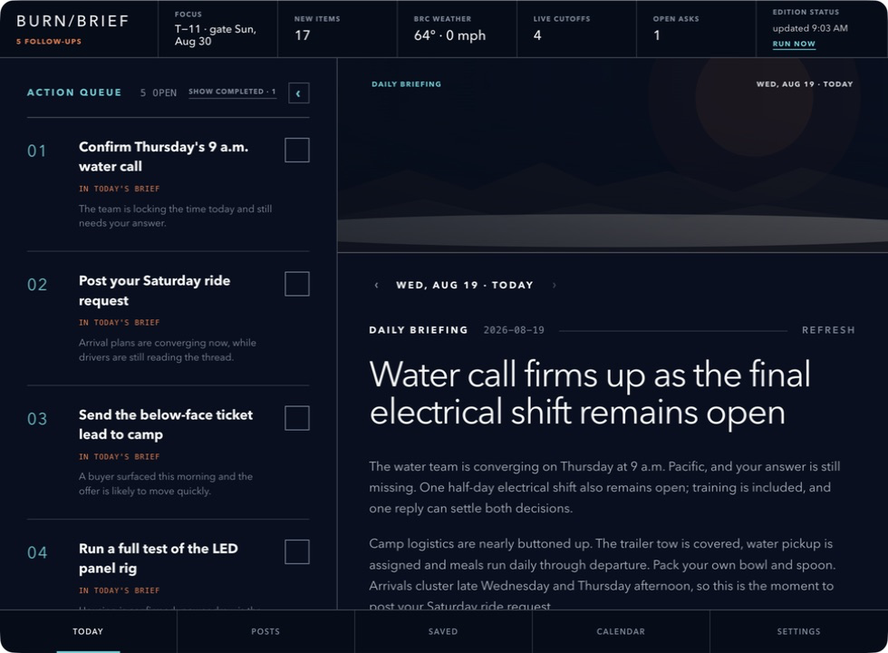

# burn/brief

Your private morning briefing for Black Rock City.



burn/brief reads the WhatsApp groups already on your Mac, finds the decisions,
deadlines and asks that actually need you, and turns them into a calm daily
edition with a checkable action queue. It uses the Claude Code or Codex CLI
you are already signed into. There is no burn/brief account, API key or server.

> Unofficial community software. burn/brief is not affiliated with or endorsed
> by Burning Man Project.

## The easiest installation

Copy this link into Claude Code or Codex and say **“Install this for me”**:

**https://github.com/jameslbarnes/burn-brief**

The repository contains instructions for the agent. It will install the app,
check which agent CLI is available, ask what name you answer to, and open the
desktop interface. The only step you may need to perform yourself is granting
Full Disk Access when macOS asks; an agent cannot grant that permission for you.

If you want to be extra explicit, paste this:

```text
Install burn/brief from https://github.com/jameslbarnes/burn-brief.
Read AGENTS.md first and follow its "Installing for a user" steps exactly.
Use the agent CLI I am currently running unless I choose another one.
Stop and walk me through any macOS permission I must grant myself.
```

## What you get

- A daily briefing that reads like a small, useful newsmagazine—not a feed
- A focused action queue beside the context that produced each task
- Deadlines, arrivals, rides, tickets, shifts, gear and direct asks
- Personal goals that are checked every day, including honest “no progress”
- Back issues, saved posts, events and completed-task history
- Current Black Rock City weather
- Optional daily delivery to **your own iMessage account**, off by default

## Privacy, honestly

- WhatsApp's local database is opened **read-only**. burn/brief never writes to
  it, sends a WhatsApp message or automates the WhatsApp client.
- App state stays in `~/.burn-brief` on your Mac. Existing pre-rename installs
  continue using `~/.whatsapp-attache` automatically so no data is lost.
- When text is analyzed, it is sent through your locally installed Claude Code
  or Codex CLI to that model provider—just as if you pasted it into that agent.
- The weather row requests the public National Weather Service forecast for
  Black Rock City. No message content is included in that request.
- Optional iMessage delivery sends only the generated briefing to the phone
  number associated with your own WhatsApp identity. It never targets others.

See [PRIVACY.md](PRIVACY.md) for the full data-flow description.

## Requirements

- macOS
- WhatsApp Desktop signed in and containing your group history
- Node.js 20 or newer
- A logged-in [Claude Code](https://docs.anthropic.com/en/docs/claude-code) or
  [Codex CLI](https://developers.openai.com/codex/cli/) installation
- Full Disk Access for the terminal or agent app doing the installation

## Choosing Claude or Codex

`auto` is the default. It uses Claude when available and otherwise Codex. You
can change this at any time in **Settings → Agent CLI** or from the terminal:

```sh
node dist/cli.js backend show
node dist/cli.js backend set auto
node dist/cli.js backend set claude
node dist/cli.js backend set codex
```

An explicit choice fails clearly if that CLI is unavailable; it never silently
switches providers. The choice applies to classification, goal compilation,
profile inference and briefing generation.

## Manual installation

Most people should let their agent do this. For maintainers:

```sh
git clone https://github.com/jameslbarnes/burn-brief.git
cd burn-brief
npm install
npm run build
node dist/cli.js doctor
node dist/cli.js init --alias YourName --backend auto
npm start
```

If `doctor` cannot read the WhatsApp source, open **System Settings → Privacy &
Security → Full Disk Access**, enable access for the terminal or agent app, quit
that app completely, reopen it and run `doctor` again.

## Optional iMessage delivery

Enable this in Settings, or use:

```sh
node dist/cli.js digest autosend on
node dist/cli.js digest autosend off
node dist/cli.js digest send             # send the current edition to yourself now
```

The first send may show a macOS Automation prompt allowing burn/brief to control
Messages. Delivery is opt-in and limited to your own iMessage identity.

## Useful commands

| Command | What it does |
| --- | --- |
| `doctor` | Checks WhatsApp access, agent CLIs and local state |
| `init --alias <name>` | Records your identity and ingests recent history |
| `backend set auto\|claude\|codex` | Selects the agent CLI |
| `focus set "…"` | Describes what this briefing should prioritize |
| `goal add "…"` | Adds a goal and compiles a matching rubric |
| `reprioritize` | Re-scores pending messages after a goal change |
| `run --max-batches 5` | Ingests and classifies a bounded batch |
| `digest run` | Writes today's briefing |
| `digest autosend on\|off` | Controls iMessage-to-self delivery |
| `npm start` | Builds and opens the desktop app |

## Architecture

```text
WhatsApp Desktop database (read-only)
        │
        ▼
deterministic prefilter ──► Claude Code or Codex CLI
        │                         │
        ▼                         ▼
local item/task store ──► daily editorial briefing
        │                         │
        └──────────────► Electron desktop interface
```

Electron never loads the native SQLite module. It spawns the Node CLI, keeping
the UI and engine isolated and avoiding Electron ABI problems.

## Development

```sh
npm install
npm run release:check
npm start
```

The app is currently macOS-only because WhatsApp's local storage and the
optional iMessage integration are platform-specific. Contributions are welcome
under the [MIT License](LICENSE).
